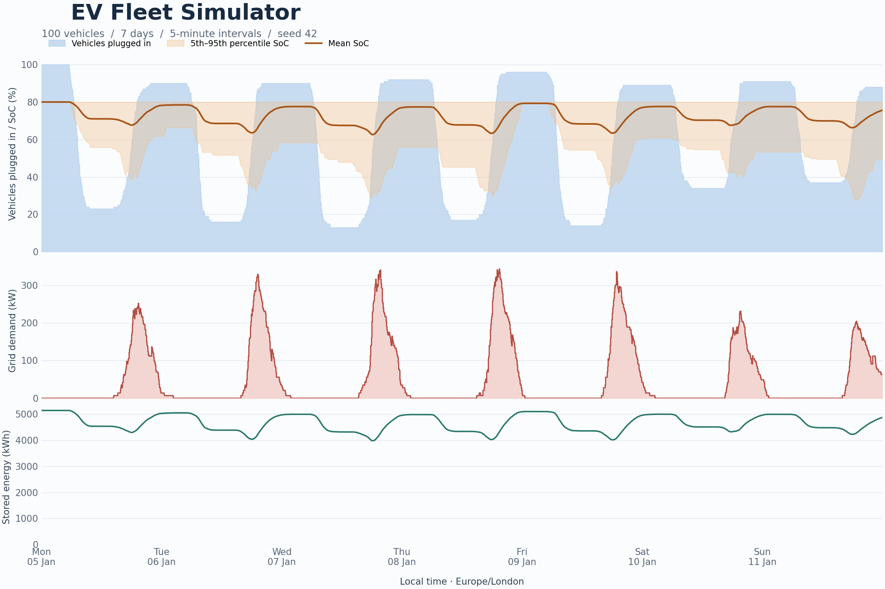
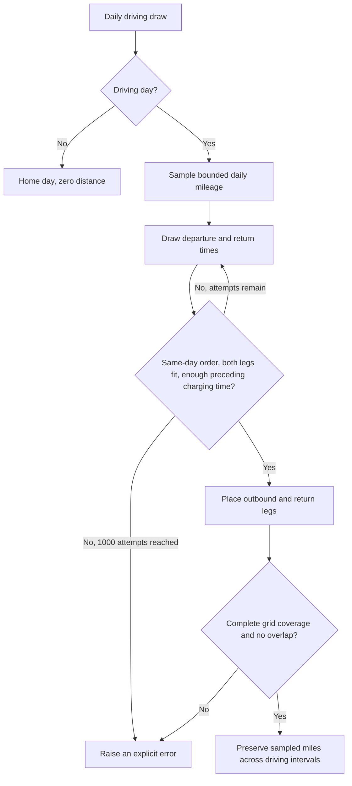
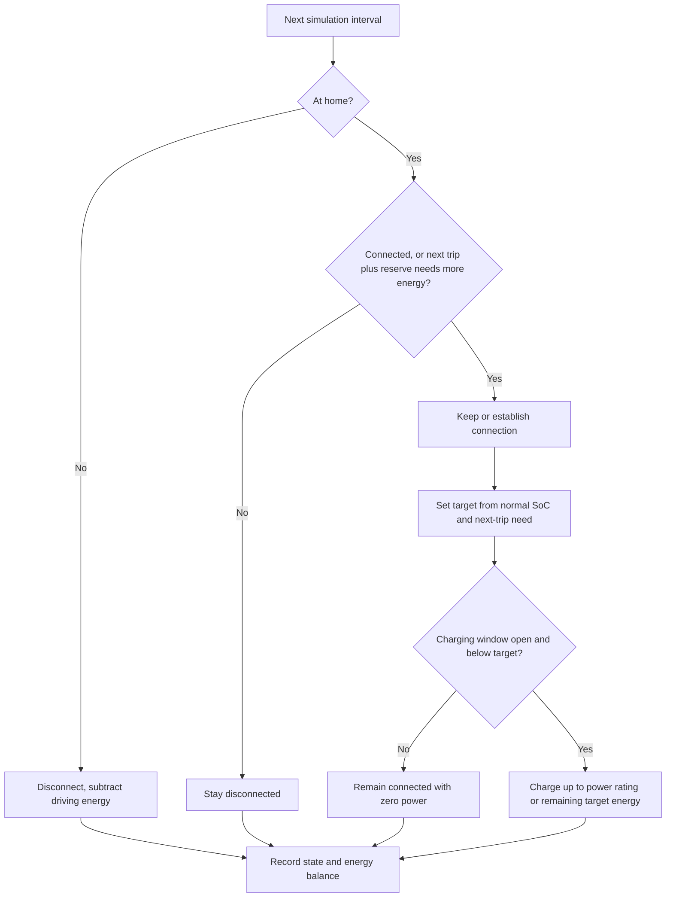

# EV Fleet Simulator

**An agent-based model of driving, home connection, battery state of charge, and fleet electricity demand.**

Simulate individual vehicles in five-minute intervals, then aggregate their behavior into a fleet demand profile. Change the archetype mix, driving probabilities (propensity to drive on weekdays vs. weekends), simulation dates, or charging efficiency and inspect both individual sessions and population results.

Detailed EV driving and charging data can be difficult to access outside vehicle manufacturers. But understanding when vehicles are driven and charged is essential for estimating electricity demand, anticipating demand peaks, and evaluating charging strategies.

This simulator starts with aggregate driver profiles and generates synthetic driving and home-charging time series. It tracks each vehicle’s battery state of charge and combines their charging loads to explore how fleet demand changes throughout the day.

The model combines stochastic behavior with explicit energy accounting. Each vehicle has a daily travel plan, a home connection schedule, and a battery whose energy is carried forward through time.



*A reproducible example with 100 vehicles, seven local calendar days, and seed 42. The shaded SoC band is the 5th–95th percentile across vehicles, not a confidence interval.*

## Run it

Requires **Python 3.10 or newer**. Open a terminal in the repository root (the folder containing `pyproject.toml`). Create and activate a virtual environment using the commands for your operating system.

**macOS / Linux** (Terminal, bash or zsh):

```bash
python3 --version
python3 -m venv .venv
source .venv/bin/activate
```

**Windows** (PowerShell):

```powershell
py --version
py -m venv .venv
.\.venv\Scripts\Activate.ps1
```

Check that the version printed above is at least 3.10 before creating the environment. If it is older, see [installation troubleshooting](#installation-troubleshooting).

**Then, on either operating system:**

```console
python -m pip install -e ".[plots]"
ev-fleet --agents 100 --days 7 --seed 42 --charts --output outputs/demo
```

Open `outputs/demo/fleet.html` in a browser, for example by double-clicking it in Finder or File Explorer. The exported chart includes its JavaScript and works offline.

For a minimal installation, use `python -m pip install -e .` and omit `--charts`. `python -m ev_fleet_sim` provides the same command-line interface.

```python
from ev_fleet_sim import SimulationConfig, run_scenario

result = run_scenario(SimulationConfig(number_of_agents=100, days=7, seed=42))
print(result.calibration.round(3))
print(result.checks)

# Actual plug-in events and their SoC, excluding initial connections.
plug_ins = result.sessions.query("session_type == 'connection' and not left_censored")
print(plug_ins[["agent_id", "start", "soc_start", "end"]].head())
result.save("outputs/demo")
```

### Explore in a notebook

```bash
python -m pip install -e ".[notebook]"
jupyter lab notebooks/fleet_explorer.ipynb
```

In JupyterLab, choose **Run → Run All Cells** to initialize the notebook and its controls. The notebook has a runnable example, population and individual charts, and optional controls for archetype selection and weekday/weekend driving probabilities. The controls use a fixed sampled fleet. Filtering the cohort preserves each retained vehicle's random stream. Click **Run scenario** to apply changes. A failed run clears old results.

The default is 100 vehicles to keep exploration responsive. Use `--agents 1000` for a larger fleet. Runtime and memory grow with the number of vehicles and intervals, and the current implementation holds the complete timeline in memory.

## What is modeled

| Layer | Inputs and decisions | Outputs |
| --- | --- | --- |
| Population | Sample six archetypes using population weights | Vehicle parameters and stable IDs |
| Daily mileage | Bernoulli driving day, bounded Beta distance | A complete daily calendar, including non-driving days |
| Travel timing | Departure and return draws, trip duration, preceding home charging opportunity | Feasible same-day away windows |
| Driving sessions | Split daily distance into outbound and return legs | Driving intervals with distance and energy consumption |
| Home connections | Departure disconnects, arrival or daily opportunity can connect | Planned connection state |
| Battery | Carry energy forward, enforce charging policy, plan for the next trip | Actual connection, SoC, charging energy, grid power |
| Reporting | Aggregate intervals and extract contiguous states | Fleet curves, plug-in SoC, sessions, calibration, physical checks |

### Travel generation and overlap prevention



The time away includes parking at the destination. Only the two driving legs consume driving energy. Timing can be resampled, but the sampled mileage and driving days stay fixed. Contradictory range or charging assumptions cause an error instead of silently shortening trips or dropping vehicles.

### Connection and charging logic



Departure ends both habitual and early connections. Scheduled charging still restricts power draw even if an early connection is needed. Driving and charging cannot occur together. A connection session may contain several charging sessions separated by zero-power intervals.

## Archetypes A–F

All display names use neutral labels. Charging behavior is stored in a separate `charging_policy` field, and travel anchors are separate from connection clocks. Renaming a label does not change the simulation rules.

| Archetype | Weight | Miles/year | Battery, kWh | Daily connection probability | Departure / return anchors | Charging rule |
| --- | ---: | ---: | ---: | ---: | --- | --- |
| A | 40% | 9,435 | 60 | 1.0 | 07:00 / 18:00 | Charge when connected |
| B | 30% | 28,105 | 72.5 | 1.0 | 07:00 / 18:00 | Charge when connected |
| C | 10% | 9,435 | 60 | 0.2 | 07:00 / 18:00 | Charge when connected |
| D | 10% | 5,700 | 60 | 1.0 | 07:00 / 18:00 | Charge when connected |
| E | 9% | 9,435 | 60 | 1.0 | 09:00 / 18:00 | Power only from 22:00 to 09:00 |
| F | 1% | 9,435 | 60 | 1.0 | 07:00 / 18:00 | Connected whenever home |

All six use 3.5 miles/kWh, a 7 kW charger, and a normal target SoC of 80%. Population weights determine sampling probabilities, so a finite fleet need not contain exactly those percentages or every archetype.

The bundled [archetype CSV](src/ev_fleet_sim/data/archetypes.csv) contains the scenario inputs and reference averages. Reference plug-in SoC, session energy, and charging duration are comparison values. They do not constrain simulated sessions. See [inputs and output fields](docs/data.md).

To change the fleet mix or driving probabilities:

```python
from ev_fleet_sim import (
    SimulationConfig,
    default_driving_assumptions,
    load_archetypes,
    run_scenario,
)

archetypes = load_archetypes()
archetypes["population_share"] = [0.25, 0.25, 0.20, 0.15, 0.10, 0.05]
assumptions = default_driving_assumptions(archetypes)
assumptions.loc[
    assumptions.archetype.eq("Archetype D"),
    ["weekday_drive_probability", "weekend_drive_probability"],
] = [0.45, 0.30]

result = run_scenario(
    SimulationConfig(),
    archetypes=archetypes,
    assumptions=assumptions,
)
```

`population_share` is the active sampling field. `population_percent` preserves the source value. A replacement CSV can also be passed with `--archetypes path/to/archetypes.csv`.

## Modeling decisions and assumptions

### Mileage is calibrated in expectation

For annual mileage $M$, $n$ simulation days, and daily driving probabilities $p_d$:

$$\mathbb{E}[\text{window miles}] = M n / 365$$

$$\mu_{\text{active day}} = \frac{M n / 365}{\sum_d p_d}$$

The denominator is the **expected** number of driving days. Dividing by the realized count would artificially force each vehicle's mileage total. The model instead allows individual runs to vary around the target.

The maximum daily distance is $R = C(1-r)e$, where $C$ is battery capacity, $r$ is the reserve fraction, and $e$ is miles/kWh. On an active day:

$$
X = R Z,\quad Z \sim \mathrm{Beta}(\alpha,\beta),\quad \alpha=5,\quad \beta=\alpha(R/\mu-1)
$$

This keeps distance within the home-only range while preserving its specified mean. Positive mileage requires $0<\mu<R$. Impossible settings raise an error. Zero annual mileage produces no driving sessions.

All archetypes initially use weekday/weekend driving probabilities of 0.85/0.55. Archetype D's lower mileage therefore means shorter trips under the defaults. Reducing its driving probability makes trips less frequent and increases their conditional mean to retain expected annual mileage. Weekday and weekend distances share the same active-day distribution.

### Timing is conditional on feasibility

Departure and return are normal draws with standard deviations of 45 and 60 minutes. Events round to the time grid. Each daily distance is split evenly into two legs, using 30 mph to calculate durations, then rounding each duration up to whole intervals. This makes realized speed no greater than the assumed speed.

The timing sampler requires enough room for both legs and enough preceding home charging opportunity. After the first trip, that opportunity check conservatively assumes the vehicle could have returned at the reserve. It accounts for charger power, charging efficiency, and scheduled charging hours. These constraints alter the timing distribution and can reject a plan that might work under a less conservative assumption. They do not prove that the unconstrained draws describe observed travel behavior.

All event intervals are half-open: `[start, end)`. Touching boundaries are allowed. Overlapping legs, truncated segments, and driving at home are rejected.

### Connections persist until departure

The source plug-in frequency is provisionally treated as a daily probability. A driving day has an opportunity at home arrival. A non-driving day has an opportunity at the nominal plug-in time. Skipping an opportunity leaves an unplugged vehicle disconnected, but does not disconnect a vehicle already plugged in.

If energy cannot cover the next planned away window plus a 10% reserve, an agent can connect early at home. Its target can rise above 80%, up to 100%. This uses perfect knowledge of the next trip and no minimum waiting period. It applies to every archetype, with the most visible effect on C. Actual connection frequency can differ from the input probability. Scheduled charging hours still apply.

### Battery energy is carried forward

For interval duration $\Delta t$ in hours, driving energy $D_t$, charging efficiency $\eta$, and grid energy $G_t$:

$$E_{t+1}=E_t-D_t+\eta G_t,\qquad D_t=\text{miles}_t/e$$

When charging is permitted, grid energy is the smaller of charger power times interval duration and energy needed to reach the target divided by efficiency. The final charging interval can therefore have average power below the charger rating.

Charging efficiency defaults to **0.99**. It is an editable modeling assumption, not a measured fleet efficiency. The model has constant driving efficiency and charger power, with no charging taper or thermal dynamics.

### Reproducibility and boundaries

Population sampling has a fixed seed. Each vehicle then gets ID-derived random streams for mileage, timing, and connections. The same IDs, date window, parameters, seed, and dependency versions reproduce the same results even if the cohort is filtered or reordered. Resampling the population can assign a different archetype to an ID. Changing the date window recalibrates the active-day distance distribution, so runs are not continuations of one another.

Runs start at local midnight, home, connected, and at normal target SoC. There is no warm-up and no knowledge of trips after the final day. Short runs therefore have start and end effects. Initial connections are excluded from connection-rate calibration and marked `left_censored` in the session table.

Times are timezone-aware, defaulting to Europe/London. Local dates span 23 or 25 hours at daylight-saving transitions while elapsed intervals remain regular. Time steps must divide 60 minutes. Timing anchors remain local clock times.

## Outputs and interpretation

| File | Contents |
| --- | --- |
| `timeseries.csv.gz` | One row per vehicle and interval, including home/connection/driving state, SoC, distance, energy, and power |
| `sessions.csv` | Connection, active charging, and driving spans with start/end SoC and boundary flags |
| `summary.csv` | Plugged-in percentage, mean and percentile SoC, total grid power, stored energy |
| `calibration.csv` | Expected versus simulated mileage, observed connection rates, early-connection counts |
| `checks.csv` | Physical and state-consistency checks |
| `agents.csv`, `assumptions.csv` | The exact sampled fleet and driving probabilities |
| `run.json` | Configuration, dependency versions, and headline results |
| `fleet.html` | Optional interactive population chart |

SoC values in interval and session tables are fractions from 0 to 1. Fleet summary SoC and connection percentages are on a 0–100 scale. A row's timestamp labels the start of the interval. `soc_end` belongs to the following boundary. Grid power is the interval average.

Mileage calibration checks an expected total, not an exact target for every short run. The physical checks test deterministic identities instead of requiring random outcomes to equal averages. See [the output field dictionary](docs/data.md) for details.

## Project structure

| Path | Responsibility |
| --- | --- |
| `src/ev_fleet_sim/population.py`, `config.py` | Inputs, fleet sampling, scenario configuration |
| `src/ev_fleet_sim/calendar.py`, `travel.py` | Driving days, mileage, feasible windows, driving legs |
| `src/ev_fleet_sim/connections.py`, `battery.py` | Connection state and battery energy accounting |
| `src/ev_fleet_sim/simulation.py`, `scenario.py` | Per-agent orchestration, public API, exports |
| `src/ev_fleet_sim/reporting.py`, `sessions.py`, `validation.py` | Summaries, event tables, validation |
| `src/ev_fleet_sim/plotting.py`, `explorer.py`, `cli.py` | Optional plots, notebook controls, command line |
| `notebooks/fleet_explorer.ipynb` | Thin exploration notebook calling the package |
| `tests/` | Regression, stochastic calibration, physical identities, event boundaries, interfaces |

## Development and verification

```bash
python -m pip install -e ".[dev,plots]"
ruff check .
ruff format --check .
python -m pytest
python -m build
```

Regression tests use a fixed seven-day scenario with one vehicle per archetype at five-minute resolution. A saved baseline checks per-vehicle mileage, energy, and state totals.

Tests also exercise energy conservation, continuity, no simultaneous driving and charging, charger limits, session boundaries, policy independence from labels, stable per-agent random streams, infeasible settings, and both daylight-saving transitions. GitHub Actions is configured to run lint, formatting, tests, package build, and a CLI smoke run.

See [validation results](docs/verification.md) for test coverage and the example run.

### Installation troubleshooting

- **Python is missing or older than 3.10:** install a supported version from [python.org](https://www.python.org/downloads/). On macOS/Linux with several versions installed, use the appropriate command when creating the environment, for example `python3.13 -m venv .venv`. An environment created with an older Python must be recreated with the newer interpreter.
- **Editable installation reports a missing `setup.py` or `setup.cfg`:** this project uses `pyproject.toml`. Older pip versions do not support this installation method. With the environment active, run `python -m pip install --upgrade pip`, then retry the installation. An upgrade is unnecessary when installation already succeeds.
- **PowerShell blocks activation:** open Command Prompt in the project folder and activate with `.venv\Scripts\activate.bat`, then run the shared installation commands above.
- **`ev-fleet`, `jupyter`, or a development tool is not found:** activate the environment in the current terminal and confirm that the relevant installation command completed successfully. The notebook and development tools require their respective extras.

## Scope and next steps

I prioritized the relationship between daily travel, home connection, and fleet demand, with visible assumptions and inspectable per-agent outputs. The model is an energy-balance approximation. It has not been fitted to event-level charging telemetry or validated as a forecast of measured grid demand.

The current scope excludes public and destination charging, multiday travel, weather, temperature-dependent efficiency, charging curves, degradation, standby consumption, charger contention, price optimization, and V2G dispatch. The 10% reserve is a planning goal. A successful physical check is not evidence of behavioral realism. Stored fleet kWh do not establish exportable V2G capacity.

Useful extensions are warm-up periods and varied initial SoC, measured distributions for departure and arrival, destination charging, seasonality and changing behavior, temperature and charging-curve models, and geographic assignment for local grid studies. Those changes should be evaluated against data before adding more model complexity.

Author: Sora Bowling.
